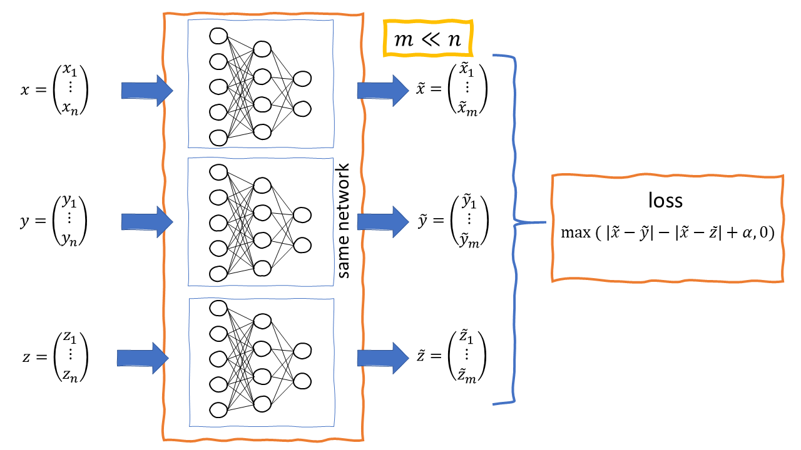

# Machine Learning in Finance

This is a collection of jupyter notebooks containing basic use cases of Machine Learning methods in the financial sector. The notebooks use only standard ML and Data Science toolkits, most notably sklearn and tensorflow. It is intended as a first introduction and reference for certain use cases.

# Start
Open the overview.ipynb notebook to get started with the use cases. Note that all use cases with tensorflow are designed to work with tensorflow 2.2 or higher versions. If you do not have tohe ability to checkout the repository and run the notebooks on your platform, you can just click the binder-badge to use the binder hosted jupyter to play around with the examples.

# Notebook overview
An overview of all existing notebooks is contained in the [overview](overview.ipynb) notebook.

## Data Visualisation with ML

### Volatility Surface Visualisation

The idea of [this notebook](vol_surface_visualisation/Volatilities_MDS.ipynb) is to visualize distances and the development of volatility surfaces. For this purpose the Multi Dimensional Scaling (MDS) algorithm is used.

## Scoring

### Peer Group Scoring using Siamese networks

[This notebook](peer_scoring_siamese/siamese.ipynb) illustrates the application of Siamese networks to construct a peer group scoring used to create peer groups for structured products. 

## Approximating Pricing using Neural Networks
Speeding up computation for costly valuation methods is of interest in many risk valuation tasks such as computing Var/C-VaR or XVA adjustments. One such approach is to train Neural Networks to approximate the pricing function. Here, although the training of the network may be quite costly, it can efficiently be evaluated within risk applications. 
An illustrative example where beginners may learn how to setup a neural network with tensorflow, evaluate results, setting different learning rate schedules and computing greeks with AAD for the simple case of using an ANN to approximate the Black Scholes call price formula (probably the most computationaly efficient model but chosen for the ease of presentation) can be found [here](nn_approximation_bs/nn_approximation_bs.ipynb).

## Deep Hedging

### Black-Scholes Call with Bid-Ask Spreads
[Here](deep_hedging/deep_hedging.ipynb) we show how to implement a neural network to compute strategies for hedging a call option (in a model fre sense) on underlyings that are traded with bid-ask spreads.

# Tribute

Thanks to our sponsors [frontmark](https://www.frontmark.de/) and [RIVACON](https://www.rivacon.com/).

